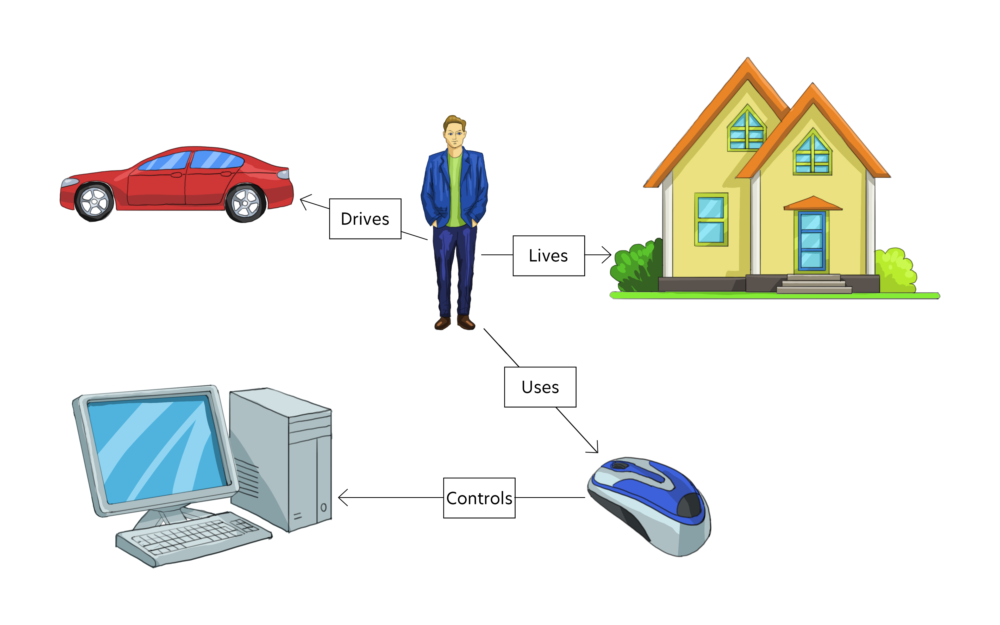
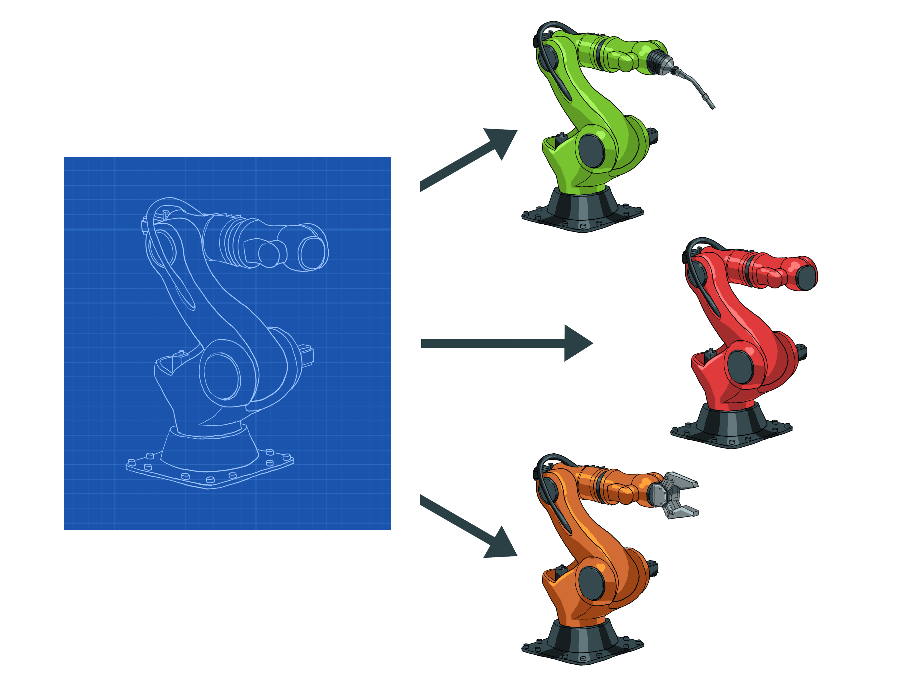
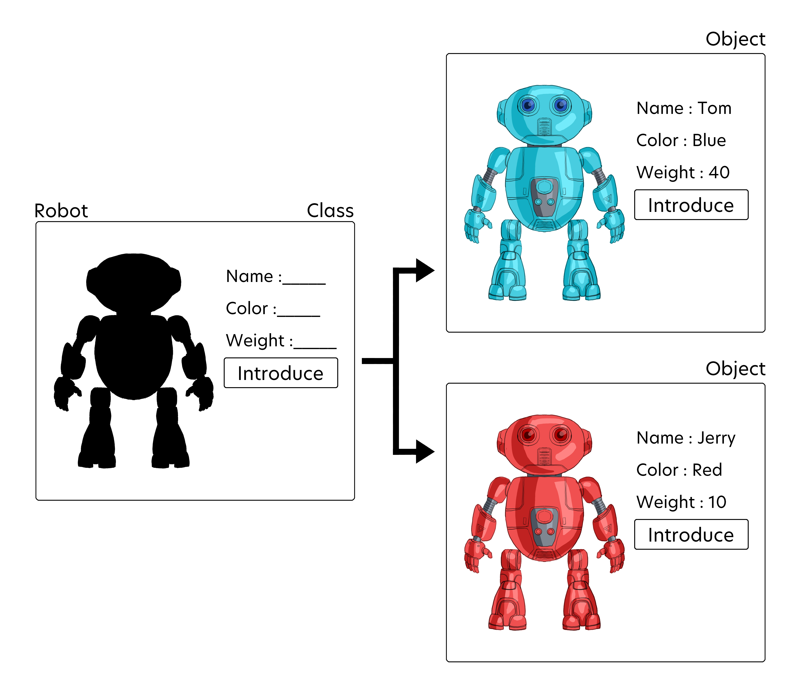
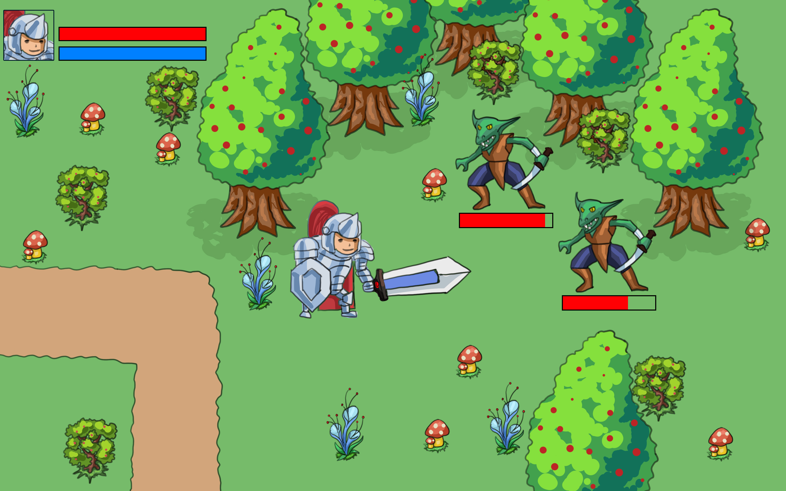
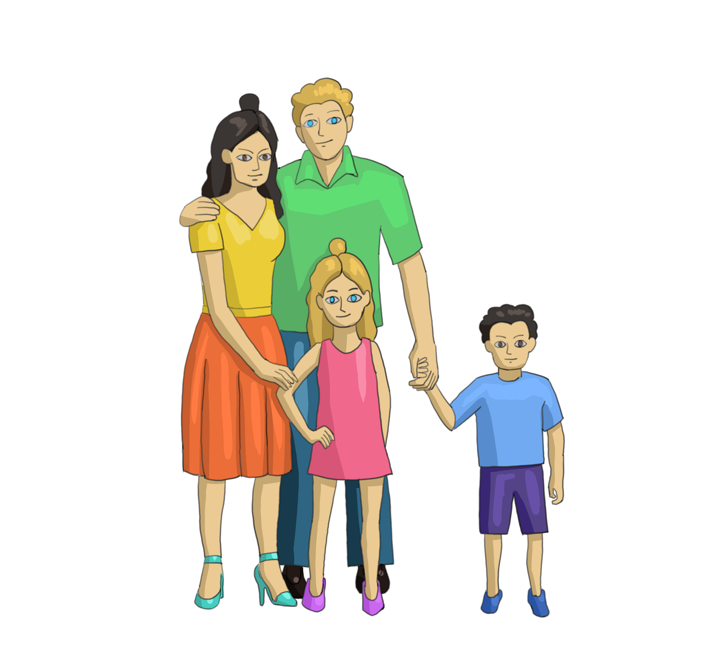
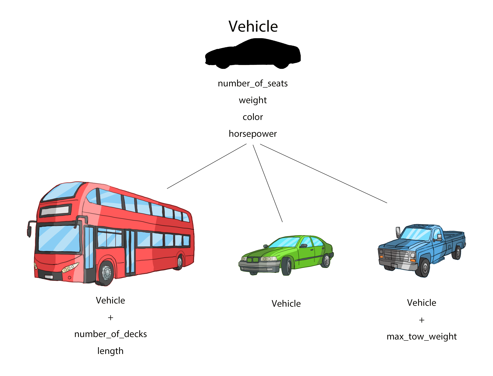
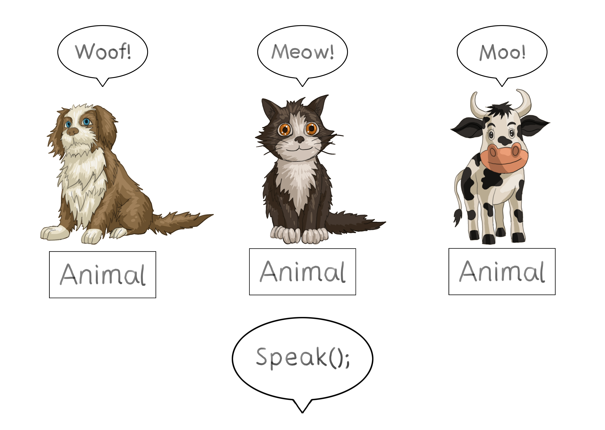
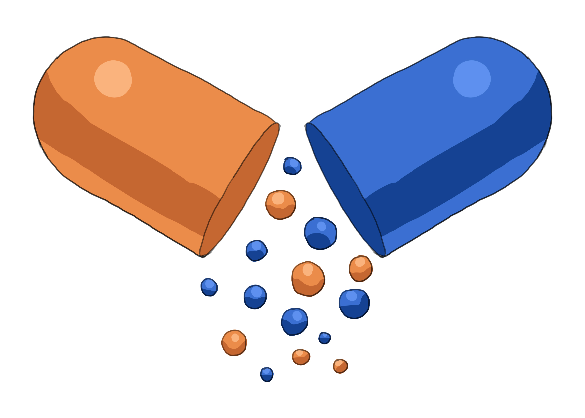

In this article, you'll be introduced to Object-Oriented Programming (OOP), a method of programming that focuses on building organized and easily scalable software. OOP is a relatively advanced topic, and it's natural if its purpose and benefits aren't immediately clear. OOP is particularly useful in larger programs that need to scale easily, as it helps with the structure and organization of the code. This guide will cover the fundamentals of OOP, providing you with the knowledge and tools to understand and work with VEX V5 code.

## Table of Contents

[Introduction to Object-Oriented Programming](#introduction-to-object-oriented-programming)

- [What is OOP?](#what-is-oop)
- [Brief History and Evolution of OOP](#brief-history-and-evolution-of-oop)

[Building Blocks of OOP](#building-blocks-of-oop)

- [Classes and Objects](#classes-and-objects)
- [Attributes and Methods](#attributes-and-methods)
- [Objects and Their Relationships in Real-World Applications](#objects-and-their-relationships-in-real-world-applications)

[A Glimpse into OOP Code](#a-glimpse-into-oop-code)

- [Defining a Class and Creating Objects](#defining-a-class-and-creating-objects)
- [Constructor](#constructor)

[The Four Pillars of OOP: A PIE](#the-four-pillars-of-oop-a-pie)

- [Abstraction](#abstraction)
- [Inheritance](#inheritance)
- [Polymorphism](#polymorphism)
- [Encapsulation](#encapsulation)

[Bringing It All Together: A Game Example](#bringing-it-all-together-a-game-example)

## Introduction to Object-Oriented Programming

### What is OOP?

Object-Oriented Programming (OOP) represents a significant shift in how we think about and write code. Instead of focusing solely on functions and logic, OOP emphasizes the importance of data structures that model real-world entities and their interactions.


*OOP models real-world entities and interactions between them.*

Previously, we have learned about procedural programming. In procedural programming, the program is organized around functions that process data in a sequence. This means the whole program is focused on how data flows and what operations are performed on it step by step. It’s a function-focused approach.

OOP, however, is a different paradigm. It focuses on structuring the information and modeling either the real world or a world we want to create through software, such as a game world. This shift in focus allows for a more organized and natural way of thinking about and interacting with data.

For instance, let's say we want to write some code to extract and analyze data from a Stack Overflow survey. The survey data includes information on how many users use certain programming languages, how many years they've been programming, and their working preferences (remote, hybrid, or in-person). In a procedural approach, we would write a series of functions to handle each part of the process: one function to scrape the data from the website, another to store this data into a CSV file, and additional functions to analyze the data. We might count the number of times each programming language is mentioned, determine how many people work in different settings, and perform analysis to identify trends, such as which languages are most popular among remote workers. The program runs these functions in sequence: first loading data, then analyzing it, and then performing further analysis.

Now, consider getting hired at a bank to work on their software backend. In this context, we have users who may or may not have bank accounts. Bank accounts have balances, can receive deposits, and have a deposit history. We can withdraw from an account, make deposits, or transfer money from one account to another through transactions. A transaction includes details such as the amount, the 'from' bank account, the 'to' bank account, and the date and time it was completed. This approach helps in modeling the banking system, capturing the relationships and interactions between users, accounts, and transactions in a structured and organized manner.


*ATM screen displaying user account options.*

By focusing on entities and their interactions, OOP allows us to create software that more closely mirrors real-world systems. This approach can make your programs more intuitive, scalable, and easier to maintain.

### Brief History and Evolution of OOP

Programming became essential as computers were developed to perform calculations and automate tasks. Initially, programming was procedural, involving writing commands that the computer processed in sequential order. Early languages like Fortran and COBOL (1950s-1960s) focused on solving mathematical problems and handling business-related tasks such as payroll processing and inventory management. The C language (1970s) advanced procedural programming for operating systems and complex applications.

The concept of Object-Oriented Programming emerged in the 1960s with Simula, introducing the idea of simulating real-world entities and processes. This marked a shift from procedural programming by allowing more natural and flexible modeling of complex systems.

In the 1980s, C++ built upon C by adding OOP features, addressing the need for better code management as software systems grew. The 1990s saw the rise of Java and Python, both of which are OOP languages. Java's ability to run on any computer system and Python's simplicity and readability brought OOP to a wider audience, making both languages popular for their versatility and built-in tools.

Today, OOP is fundamental in computer science education and a standard practice in software development, helping developers manage complexity, improve code reusability, and create scalable solutions.

## Building Blocks of OOP

### Classes and Objects

In Object-Oriented Programming, classes and objects are fundamental concepts. A class is a blueprint for creating objects, defining their structure and behavior. An object is created from a class, representing a concrete entity based on the class blueprint.

#### Example: Designing a RoboticArm class

Imagine you're designing a fleet of robots for a competition. Instead of writing separate pieces of code for each robot's functionality, OOP lets you create a blueprint for a robot. You can then create as many robots as you need from this blueprint, each with its own unique features but all sharing the same core design.


*A blueprint on the left with three robots modeled from it on the right.*

The blueprint you see on the left is the class, and the specific robots you see on the right, based on the blueprint, are known as objects. All classes have names; let's say the name of this class is `RoboticArm`. This class serves as a template for creating various robotic arms. When you create a robot from this class, you are instantiating the class, and each instantiated robot is called an instance of the class. Each robot shares the same foundational structure but can have unique characteristics.

By creating different robots from the `RoboticArm` class, you can manage their interactions and behaviors in an organized way. This approach allows you to efficiently handle complex systems and ensures that all robots adhere to a consistent design and functionality.

#### Example: Designing a school management system

Consider a school management system with separate classes for `Student` and `Teacher`.

- `Student` class:

  - The `Student` class serves as a blueprint for creating student objects.
  - Each student object, also known as an instance of the `Student` class, represents an individual student.
  - These student instances can then be part of the school system.

- `Teacher` Class:

  - The `Teacher` class serves as a blueprint for creating teacher objects.
  - Each teacher object, also known as an instance of the `Teacher` class, represents an individual teacher.
  - These teacher instances can then be part of the school system.

By defining these classes, you can create student and teacher objects, each of which is an instance of their respective class. However, this is not the complete picture, as we also need to define attributes and methods to fully describe these entities and their behaviors.

### Attributes and Methods

In OOP, the key components of a class are its attributes and methods. Attributes, which are the properties of an object, describe its characteristics. Methods define the actions an object can perform. Attributes are like variables that store data specific to an object. Methods, on the other hand, are functions that belong to a class and define the actions that the object can perform.

#### Example: Robot attributes and behaviors

Imagine designing a class called `Robot`. This class is a placeholder for what a robot is like (its attributes) and what it can do (its methods). For example, a robot might have a name, color, and weight, and it can perform actions like introducing itself.


*A class called Robot, and two object instances of this class with their unique attributes.*

One robot can be called "Tom", be blue, and weigh 40 lbs, and another robot can be named "Jerry", be red, and weigh 10 lbs. When you create objects, you can give them custom attributes. However, when it comes to methods, these are less customizable, as we can see that both objects have the same method, which is "Introduce". Nonetheless, each attribute and method is linked to a given object. For example, the `Introduce` method done by the first object and the `Introduce` method done by the second object are not the same method. They always apply to their respective object.

#### Example: Student and Teacher attributes and behaviors

Consider the school management system from before.

- `Student` class:

  - Each student has a name, age, and school ID.
  - Students can perform actions like enrolling in courses and taking exams.

- `Teacher` Class:

  - Each teacher has a name, subject, and employee ID.
  - Teachers can perform actions like teaching classes and grading exams.

By defining these classes, you can create student and teacher objects, each with its own properties and actions. This setup allows for efficient handling of all student and teacher-related operations.

### Objects and Their Relationships in Real-World Applications

One key idea in OOP is the concept of state. The state of an object refers to its data at a particular moment in time. You should use OOP when your system has entities with states that change and interact. For example, in a video game, characters and items have changing health points and positions; in a banking system, accounts have changing balances and transaction histories; and in a robotics system, sensors and motors have changing readings and positions. At any given moment, you can take a snapshot of the system, showing the current state of all its components. Let's now take a closer look at how OOP is used in these systems.

#### Video game

In video games, objects are used to represent various entities, each with their own properties and behaviors. Making video games is a common use of OOP because it helps manage the complexity of game development. For instance:

- `Player` object: Might have attributes like health, score, and inventory, and methods for moving, attacking, and interacting with the game world.
- `Enemy` objects: Have similar attributes and methods, tailored to their specific behaviors and interactions with the player.
- `Item` objects: Include attributes for type and value, and methods for being picked up or used by the player.


*A player and goblins in a game, each with different health levels.*

This object-oriented approach allows game developers to create complex, interactive environments where different entities interact in predictable and manageable ways.

#### Banking system

A banking system is another example where objects are used to represent various entities and their interactions. In this system, customers, accounts, and transactions are modeled as objects:

- `Customer` objects: Have attributes such as name, address, and customer ID, and methods for opening accounts and making transactions.
- `Account` objects: Have attributes like balance, account number, and transaction history, and methods for depositing and withdrawing money.
- `Transaction` objects: Represent each transaction with attributes like transaction ID, amount, date, and type (deposit, withdrawal, transfer), and methods for processing the transaction.

This approach allows the banking system to manage customer interactions, account operations, and transactions in an organized and efficient manner.

#### Robotics system

In a robotic system, objects can be used to manage different components, such as sensors, motors, and controllers. For example, consider a Robot object that interacts with various other objects:

- `Robot` object: Represents the overall robot, containing attributes and methods that define its general properties and behaviors.
- `Sensor` objects: Represent specific types of sensors, like temperature sensors or distance sensors, with attributes that describe their characteristics, such as current readings and status.
- `Motor` objects: Represent the robot's actuators, which control movement and actions.
- `Controller` object: Acts as the brain of the robot, processing input from sensors and sending commands to the motors to perform actions. It makes decisions based on sensor data.

The `Controller` coordinates the interactions between sensors and motors to ensure the robot performs its tasks correctly. This structured relationship simplifies the management and coordination of the robot's various components.

## A Glimpse into OOP Code

We have gone over the basic theory of classes, objects, attributes, and methods. Now it's time to look at some code. Let's look at a video game example. We'll start by creating a simple `Monster` class, which you could also call `Enemy`. This class will have attributes to store the monster's data and a constructor to initialize these attributes. Later, we will add methods for the monster to perform actions like moving and attacking.

### Defining a Class and Creating Objects

In OOP, as we've seen multiple times, a class is a blueprint for creating objects. Let's start by defining the `Monster` class:

```python
class Monster:
    # Add blueprint here
END class
```

We use the keyword `class` followed by the class name. It's a convention to capitalize class names in `CamelCase` and use `snake_case` for variables.

> **Note:** We will use the `#` symbol for single-line comments in this document.

Now we can add `name`, `health`, and `energy` as attributes of this class:

```python
class Monster:
    # Attributes
    name = "Goblin"
    health = 90
    energy = 40
END class
```

We can create Monster objects by calling the `Monster` class like a function and storing the objects in variables, such as `monster1` and `monster2`:

```python
class Monster:
    # Attributes
    name = "Goblin"
    health = 90
    energy = 40
END class

monster1 = Monster()
monster2 = Monster()
```

These `monster1` and `monster2` objects are different and stored in different memory locations on your computer. This means that each object has its own set of attributes and can be modified independently of the other. Even though they are both created from the same Monster class, they exist separately in memory.

But right now, all calls to `Monster()` will create a monster with `name = "Goblin"`, `health = 90`, and `energy = 40`. The whole point of classes is for them to be a blueprint, not to specify the exact details themselves. What if we want a monster with 100 health and 10 energy, named "Shark"? To achieve this flexibility, we need a way to initialize each monster with different values when we create them. This is where constructors come in.

### Constructor

Spoiler alert: there is a way to create custom objects on the fly, like so:

```python
monster1 = Monster("Goblin", 90, 40)
monster2 = Monster("Shark", 100, 10)
```

However, before we dive into how to make this work, let's remind ourselves about how functions work. Remember how we could pass arguments to functions to perform specific tasks? Let's review what a parameter in a function definition is with a simple example:

```python
function greet(name):
    print("Hello, " + name)
END function

greet("Alice")  # This will output: Hello, Alice
```

In this example, `name` is a parameter of the `greet()` function, and `"Alice"` is the argument we pass when calling the function. The function then uses this argument to perform its task.

So now, going back to creating objects, observe that this:

```python
monster1 = Monster("Goblin", 90, 40)
```

Resembles a function call. To pass these custom values when creating an object, we need to modify the class to accept inputs. This is done by adding a constructor to the class.

A constructor is a special function that is automatically called when a new object is created from the class. It initializes the object's attributes with specific values. Here's how we can define the constructor for the `Monster` class:

```python
class Monster:
    # Constructor to initialize the monster's attributes
    function Monster(init_name, init_health, init_energy):
        name = init_name
        health = init_health
        energy = init_energy
    END function
END class
```

In this version, `init_name`, `init_health`, and `init_energy` are parameters of the constructor, and `name`, `health`, and `energy` are the attributes of the class.

However, to make it clearer that we are setting the attributes of the current object, we can use the `this` keyword. The `this` keyword refers to the current instance of the object, ensuring that the parameters are assigned to the correct attributes. Here's how we modify the constructor:

```python
class Monster:
    # Constructor to initialize the monster's attributes
    function Monster(init_name, init_health, init_energy):
        this.name = init_name
        this.health = init_health
        this.energy = init_energy
    END function
END class
```

Finally, since we can use the `this` keyword to refer to the attributes of the specific object, we can simplify our parameter names. Instead of using `init_name`, `init_health`, and `init_energy`, we can use `name`, `health`, and `energy` directly. This makes the code more readable and concise:

```python
class Monster:
    # Constructor to initialize the monster's attributes
    function Monster(name, health, energy):
        this.name = name
        this.health = health
        this.energy = energy
    END function
END class
```

Remember, in programming, the variable on the left of the equals sign (e.g., `this.name`) is the attribute of the object, and the value on the right (e.g., `name`) is the parameter passed to the constructor. This means that the attribute `this.name` is being assigned the value of the parameter `name`. In other words, the parameter value passed to the constructor is stored in the attribute of the specific object.

If you're still confused, bare with me.

Let's try to understand the `this` keyword. `this.name` refers to the `name` attribute of the current object instance. Here's a breakdown:

- `this.name = name`: The attribute `name` of the current object (referred to by `this`) is assigned the value of the `name` parameter passed to the constructor.
- Without the `this` keyword, the constructor would not know whether `name` refers to the object's attribute or the parameter. Using this makes it clear that we are setting the object's attribute.

All in all, here is what we have:

```python
class Monster:
    # Constructor to initialize the monster's attributes
    function Monster(name, health, energy):
        this.name = name
        this.health = health
        this.energy = energy
    END function
END class

monster1 = Monster("Goblin", 90, 40)
monster2 = Monster("Shark", 100, 10)
```

By using the constructor, we can initialize each monster with different values for name, health, and energy, making our class flexible and reusable, just how it was meant to be.

## The Four Pillars of OOP: A PIE

"A PIE" is an acronym to help you remember the main principles of OOP: Abstraction, Polymorphism, Inheritance, and Encapsulation. These principles are essential for creating well-structured and efficient programs. To ensure a smooth progression and better understanding, I will invert the order of "P" and "I" and explain Inheritance before Polymorphism.

### Abstraction

The concept of abstraction exists in programming even outside of the realm of OOP. Abstraction allows you to use functions without needing to understand their internal implementation details. This ensures that only the necessary information is exposed to the user, making the system easier to work with and maintain.

Specifically to OOP, abstraction involves hiding the complex implementation details and showing only the necessary features of an object. This makes the code easier to work with and understand by focusing on what an object does rather than how it does it.

One example of abstraction is smartphone apps. When you use an app on your phone, you interact with a simple interface. You don’t need to know the complex processes happening in the background to open the app and use its features.


*A smartphone abstracts out the complicated processes required to open an app.*

Abstraction simplifies code maintenance and enhances readability. It allows different parts of a program to be developed and worked on independently as long as the inputs and outputs remain consistent.

For example, when you start a car, you don't need to know how the engine, spark plugs, or battery work. You only need to know how to start the car, turn the steering wheel, accelerate, and brake. The processes that make these actions possible happen in the background and are considered "private" information.


*A Car object can have private methods, only accessible to the car object itself, and public methods, accessible to any other object interacting with the Car object.*

In the illustration above, we have a method like `create_spark()`, which only needs to be called within the `turn_on()` method, which in turn is accessible by other objects, such as `Driver`. So when `turn_on()` gets called by `Driver`, certain private methods will in turn get called by `turn_on()` in order to turn on the car. Here is what the `turn_on()` method might look like, along with the private methods which it calls:

```python
class Car:
    public function turn_on():
        engage_ignition_switch()
        send_power_from_battery()
        engage_starter_motor()
        turn_crankshaft()
        mix_fuel_and_air()
        ignite_spark_plugs()
        start_combustion()
    END function

    private function engage_ignition_switch():
        # code to engage ignition switch
    END function

    private function send_power_from_battery():
        # code to send power from battery
    END function

    ...

    private function start_combustion():
        # code to start combustion
    END function

END class
```

> Note: This is pseudocode. Different programming languages have different ways to specify whether a function is public or private. In this example, we indicate whether a function is public or private directly in front of the function definition.

And this is the whole point of abstraction: we just care about calling the method, not about how it's implemented.

#### Example: Abstracting Monster Class Details

Similarly, in a video game, you might have a `Monster` class where only certain methods and attributes are exposed to other parts of the program. Here’s an example:

```python
class Monster:
    # Constructor to initialize the monster's attributes
    function Monster(name, health, energy):
        this.name = name
        this.health = health
        this.energy = energy
    END function

    # Public method to make the monster talk
    public function talk():
        print("I am an enemy. Run!")
    END function

    # Public method to make the monster attack
    public function attack():
        print("The monster attacks!")
        # Define the attack mechanics here
    END function

    # Private method to calculate damage
    private function calculate_damage():
        return this.health * 0.1
    END function

    # Private method to regenerate energy
    private function regenerate_energy():
        this.energy = this.energy + 10
    END function
END class
```

In this example, the Monster class has a constructor to initialize its attributes (`name`, `health`, and `energy`). It also has public methods `talk()` and `attack()` that allow the monster to speak and attack. The private methods `calculate_damage()` and `regenerate_energy()` manage internal calculations and energy regeneration, and are not accessible from outside the class. This demonstrates the concept of abstraction by exposing only the necessary details to other parts of the program while keeping the internal workings hidden.

### Inheritance

Inheritance is a very powerful feature in OOP. It allows classes to inherit behaviors and attributes from each other, forming hierarchies. This promotes code reusability and helps in building new classes based on existing ones without having to rewrite code.


*Family with children inheriting features from their parents: The son has his dad's curly hair and his mom's eye and hair color, while the daughter has her mom's straight hair and her dad's eye and hair color.*

Imagine this: we have to model a fleet of vehicles for a company. They have trucks, buses, and regular sedans. We can create a `Vehicle` class that includes shared attributes and methods common to all vehicles, such as speed, fuel capacity, and the ability to start and stop. This `Vehicle` class provides a foundation for creating more specific vehicle types, allowing us to efficiently manage common features and behaviors.


*Different types of vehicles inheriting common features from a base `Vehicle` class.*

Inheritance is useful when you have an existing class, and you want to build a new class that uses the features of the previous class but with additional features and functionalities. Classes derived from an existing class are called subclasses, extended classes, or child classes. The class from which the subclass is derived can be referred to as the superclass, parent class, or base class.

#### Example: Inheriting from the Monster Class

Let's use our `Monster` class to illustrate inheritance. Here is our class `Monster`:

```python
class Monster:
    # Constructor to initialize the monster's attributes
    function Monster(health, energy):
        this.health = health
        this.energy = energy
    END function

    # Base method for attack
    public function attack():
        print("The monster attacks!")
        # Define the attack mechanics here
    END function
END class
```

Note that I have removed the `name` attribute from the constructor. This is because each subclass will represent a specific type of monster, making the `name` attribute redundant.

Now, we will create subclasses for specific types of monsters, such as Goblin, Dragon, and Zombie. Each subclass will inherit from the `Monster` class and can add its own unique attributes and methods:

```python
# ======== Subclasses ========
class Goblin extends Monster:
    function Goblin(health, energy, stealth_level):
        this.super(health, energy)
        this.stealth_level = stealth_level  # Unique attribute for Goblin
    END function

    public function hide():
        print("The Goblin hides in the shadows!")
        # Define the hiding mechanics here
    END function
END class

class Dragon extends Monster:
    function Dragon(health, energy, fire_power):
        this.super(health, energy)
        this.fire_power = fire_power  # Unique attribute for Dragon
    END function

    public function fly():
        print("The Dragon takes to the skies!")
        # Define the flying mechanics here
    END function
END class

class Zombie extends Monster:
    function Zombie(health, energy, decay_level):
        this.super(health, energy)
        this.decay_level = decay_level  # Unique attribute for Zombie
    END function

    public function regenerate():
        print("The Zombie regenerates its health!")
        # Define the regeneration mechanics here
    END function
END class
```

Now, we can create instances of these subclasses and call their methods:

```python
goblin = Goblin(50, 30, 70)
dragon = Dragon(300, 200, 500)
zombie = Zombie(70, 50, 10)

goblin.hide()    # Output: The Goblin hides in the shadows!
dragon.fly()     # Output: The Dragon takes to the skies!
zombie.regenerate()  # Output: The Zombie regenerates its health!
```

Now you may be wondering, what is `this.super()` in the constructor of each subclass? The `super` keyword is used to call the constructor of the parent class. This ensures that the attributes defined in the `Monster` class, such as `health` and `energy`, are properly initialized in the subclasses. By using `this.super(health, energy)`, we are saying, "initialize these attributes in the parent class before adding any subclass-specific attributes or methods".

Let's dive deeper into the `Goblin` constructor. When we create a new `Goblin` object, we pass the `health` (50), `energy` (30), and `stealth_level` (70) parameters. The `this.super(health, energy)` call in the `Goblin` constructor ensures that the `health` and `energy` attributes are initialized by the `Monster` class's constructor. Then, we set the `stealth_level` attribute specific to the `Goblin` class. This allows us to add additional attributes or methods that are unique to the `Goblin` class while still retaining the common attributes and methods defined in the `Monster` class.

The constructors for the `Dragon` and `Zombie` classes work similarly. They call the `super` constructor to initialize the inherited attributes and then set their unique attributes (`fire_power` for `Dragon` and `decay_level` for `Zombie`). This way, each subclass can build upon the base class while adding its own specialized features.

An interesting aspect is that you can still do this:

```python
goblin = Goblin(50, 30, 70)
dragon = Dragon(300, 200, 500)
zombie = Zombie(70, 50, 10)

goblin.attack()    # Output: The monster attacks!
dragon.attack()     # Output: The monster attacks!
zombie.attack()  # Output: The monster attacks!
```

Even though we didn't define the `attack()` method inside the subclasses, the base class had it so the subclasses inherit it. Since the subclasses inherit attributes and methods of the base class, they can use the attack() method defined in the Monster class.

This example shows how inheritance allows us to define a common set of attributes and methods in a base class (`Monster`) and then extend this functionality in subclasses (`Goblin`, `Dragon`, `Zombie`). Each subclass inherits the properties and behaviors of the base class but can also introduce its own unique features.

### Polymorphism

The word polymorphism comes from the Greek words "poly" (meaning many) and "morph" (meaning forms). In programming, it refers to the ability of a single function or method to work in different ways depending on the object it is acting upon. Polymorphism promotes flexibility and integration in your code, making it easier to manage and extend.

An example of polymorphism is a group of animals where each animal can make a sound, but the sound differs depending on the type of animal. For instance, dogs bark, cats meow, and cows moo. Despite these differences, we can treat them all as animals and call the same `speak()` method on each, with the actual output varying based on the specific animal.


*Different animals (dog, cat, cow) inherit from `Animal` class and each implement their own `speak()` method.*

Another example of polymorphism is the President of the United States and his advisors. The President has many advisors, each specializing in different fields:

- Military Advisors
- Legal Advisors
- Healthcare Advisors
- Economic Advisors

The President is not an expert in military strategy, legal affairs, healthcare, or economics. And he doesn't need to be. He employs a polymorphic approach to governance by asking his advisors for their expert advice. When the President asks for advice, each advisor responds according to their expertise, but they all understand the common request to "advise". The President should be able to simply say "advise" and each advisor will know what to do in their respective field. For example, the President doesn't need to tell the military general any details of how to run military operations; the general knows what to do.

This approach allows the President to govern effectively without getting bogged down in the specifics of each area. Each advisor provides their expert input, allowing the President to make informed decisions based on their recommendations. This illustrates how polymorphism allows a single interface (the "advise" method) to be used for different types of advice, simplifying the President's role and leveraging the expertise of his advisors.


*The President saying "advise" to a group of advisors, each providing expert advice based on their field.*

In OOP, polymorphism is the ability of different objects to respond differently to the same method call. This allows developers to create code that can be reused across different objects and classes, facilitating the process of having multiple classes that can be treated the same way.

#### Example: Polymorphism with the Monster Class

Let's revisit our `Monster` class and its subclasses, but with some minor changes:

```python
# ======== Base Class ========
class Monster:
    # Constructor to initialize the monster's attributes
    function Monster(health, energy):
        this.health = health
        this.energy = energy
    END function

    # Base method for attack
    public function attack():
        print("The monster attacks!")
        # Define the attack mechanics here
    END function
END class

# ======== Subclasses ========
class Goblin extends Monster:
    function Goblin(health, energy, stealth_level):
        this.super(health, energy)
        this.stealth_level = stealth_level  # Unique attribute for Goblin
    END function

    public function attack():
        print("The Goblin swings a club!")
        # Define the attack mechanics for the Goblin here
    END function
END class

class Dragon extends Monster:
    function Dragon(health, energy, fire_power):
        this.super(health, energy)
        this.fire_power = fire_power  # Unique attribute for Dragon
    END function

    public function attack():
        print("The Dragon breathes fire!")
        # Define the attack mechanics for the Dragon here
    END function
END class

class Zombie extends Monster:
    function Zombie(health, energy, decay_level):
        this.super(health, energy)
        this.decay_level = decay_level  # Unique attribute for Zombie
    END function

    public function attack():
        print("The Zombie bites viciously!")
        # Define the attack mechanics for the Zombie here
    END function
END class
```

In the `Monster` class, we define a base method called `attack()`. This method prints a generic message indicating that the monster attacks. The `Monster` class serves as a blueprint for creating different types of monsters, and each monster can have its own way of attacking.

To create specific types of monsters, we define subclasses such as `Goblin`, `Dragon`, and `Zombie`. Each subclass inherits from the `Monster` class and redefines the `attack()` method to provide its own specific implementation. This is how polymorphism works: the same method call (`attack()`) can produce different behaviors depending on the type of object it is called on.

For example, in the `Goblin` class, the `attack()` method is redefined to have the goblin swing a club. Similarly, the `Dragon` class redefines the `attack()` method to breathe fire, and the `Zombie` class redefines specifies attacking as biting.

Now, let's create instances of these subclasses and call the `attack()` method on each:

```python
goblin = Goblin(50, 30, 70)
dragon = Dragon(300, 200, 500)
zombie = Zombie(70, 50, 10)

goblin.attack()  # Output: The Goblin swings a club!
dragon.attack()  # Output: The Dragon breathes fire!
zombie.attack()  # Output: The Zombie bites viciously!
```

When we call `attack()` on each of these objects, the specific implementation of the `attack()` method in each subclass is executed. This demonstrates polymorphism: the ability to use the same method call on different objects, with each object responding in its own way. Polymorphism allows us to write more flexible and extensible code, as new types of monsters can be added with their own unique behaviors without altering the existing code structure.

### Encapsulation

Encapsulation is the fourth and final pillar of OOP. It revolves around restricting direct access to some of the object's components, protecting the internal state of the object from unintended interference and misuse. This concept is built on the idea of "data hiding", which is related to abstraction.


*Encapsulation represents protecting an object's internal state.*

To make this concept more intuitive, let's consider an example with a dog. We'll create a `Dog` class that has private attributes such as `mood`, `hunger`, and `energy`, and a private method `bark()`. These private attributes and methods can only be accessed and modified through public methods such as `sleep()`, `play()`, and `feed()`.


*The dog's private attributes and methods are only accessible through its public methods.*

Let's now take a look at the code-equivalent of this example. Below is the code that represents the `Dog` class:

```python
class Dog:
    # Constructor to initialize the dog's attributes
    function Dog(mood, hunger, energy):
        this.mood = mood
        this.hunger = hunger
        this.energy = energy
    END function

    # Private method to bark
    private function bark():
        print("Woof! Woof!")
    END function

    # Public method to sleep, increases energy and hunger
    public function sleep():
        this.energy += 10
        this.hunger += 5
    END function

    # Public method to play, increases mood, decreases energy, and triggers bark
    public function play():
        this.mood += 10
        this.energy -= 10
        this.bark()
    END function

    # Public method to feed, decreases hunger and increases mood
    public function feed():
        this.hunger -= 10
        this.mood += 5
        this.bark()
    END function
END class
```

Now, let's analyze this code to understand how encapsulation works in the Dog class.

- `bark()` is a private method, meaning it cannot be called directly from outside the Dog class.
- The `sleep()` method is public and increases the dog's energy and hunger.
- The `play()` method is public, increases the dog's mood, decreases energy, and calls the private `bark()` method.
- The `feed()` method is public, decreases the dog's hunger, increases its mood, and also calls the private `bark()` method.

Encapsulation ensures that the internal state of the `Dog` object is protected and can only be changed in a controlled manner through well-defined interfaces (public methods). This restricts direct access to some of the object's components to prevent unintended interference and misuse.

By encapsulating the `bark()` method and the attributes `mood`, `hunger`, and `energy`, we ensure that these elements are protected and can only be accessed and modified through the specified public methods. This helps maintain the integrity and consistency of the `Dog` object's state, making the code more reliable and easier to maintain.

Now let's create a Dog object and interact with it using its public methods:

```python
dog = Dog(50, 30, 70)  # mood, hunger, energy

# The dog plays
dog.play()
# Output: Woof! Woof!
# After playing: Mood +10, Energy -10

# Display the dog's status
dog.display_status()
# Output:
# Mood: 60
# Hunger: 30
# Energy: 60

# The dog sleeps
dog.sleep()
# After sleeping: Energy +10, Hunger +5

# Display the dog's status
dog.display_status()
# Output:
# Mood: 60
# Hunger: 35
# Energy: 70

# The dog is fed
dog.feed()
# Output: Woof! Woof!
# After feeding: Hunger -10, Mood +5

# Display the dog's status
dog.display_status()
# Output:
# Mood: 65
# Hunger: 25
# Energy: 70

# Try to directly access the private bark method (this will result in an error)
# dog.bark()  # Uncommenting this line will cause an error
```

In this code snippet, we first create a Dog object with mood set to 50, hunger at 30, and energy at 70. As we call the public methods `play()`, `sleep()`, and `feed()` the private attributes are modified and displayed accordingly.

Additionally, the `bark()` method is private and cannot be called directly from outside the class. Uncommenting `dog.bark()` will result in an error because encapsulation restricts access to private methods. This ensures that the dog's internal state and behaviors are only modified through the controlled interfaces provided by the public methods (`play()`, `sleep()`, and `feed()`).

#### Example: Encapsulating Monster Class Details

To illustrate encapsulation, let's use our `Monster` class example. Here is our class `Monster`:

```python
class Monster:
    class Monster:
    # Constructor to initialize the monster's attributes
    function Monster(health, energy):
        this.health = health
        this.energy = energy
    END function

    # Private method to simulate the monster's roar
    private function roar():
        print("The monster roars menacingly!")
    END function

    # Public method to perform an attack action
    public function perform_attack():
        this.energy -= 10
        this.roar()
        print("The monster attacks!")
        # Define the attack mechanics here
    END function

    # Public method to display the monster's status
    public function display_status():
        print("Health: " + this.health)
        print("Energy: " + this.energy)
    END function

    # Method to handle taking damage
    public function take_damage(damage_amount):
        this.health -= damage_amount
        if this.health < 0:
            this.health = 0
        this.roar()
    END function
END class
```

> **Note:** For simplicity, let's imagine we can create a generic monster without using subclasses or specific names.

In this example, the `roar()` method is private, meaning it cannot be called directly from outside the Monster class. Instead, we use the public method `perform_attack()` to access the `roar()` method and simulate the monster's attack. Additionally, we have a public method `display_status()` to show the monster's current status and a `take_damage()` method to handle damage taken by the monster.

By encapsulating the `roar()` method, we ensure that the roar behavior is protected and can only be triggered in a controlled manner through the `perform_attack()` or `take_damage()` methods. This approach helps prevent unintended interference with the monster's behavior.

To demonstrate how encapsulation works in practice, let's create a Monster object and interact with it using the public methods:

```python
monster = Monster(50, 30)

# Display the monster's status
monster.display_status()

# Perform an attack
monster.perform_attack()

# Try to directly access the private roar method (this will result in an error)
# monster.roar()  # Uncommenting this line will cause an error

# Inflict damage to the monster
monster.take_damage(20)
monster.display_status()
```

Which will output:

```python
Health: 50
Energy: 30
The monster roars menacingly!
The monster attacks!
Health: 50
Energy: 20
The monster roars menacingly!
Health: 30
Energy: 20
```

In this way, encapsulation ensures that we interact with the Monster object through its public methods, maintaining control over how its internal state and behaviors are accessed and modified.

## Bringing It All Together: A Game Example

In a typical 2D game, various components work together to create an immersive and interactive experience. These components include graphics rendering, user input handling, physics simulations, sound effects, and game logic. Graphics rendering involves drawing the game characters, environment, and other visual elements on the screen. User input handling processes player actions, such as moving a character or pressing a button. Physics simulations manage how objects interact with each other, including collision detection and movement. Sound effects add auditory feedback, enhancing the player's engagement.

Of course, there are many complex elements involved in developing a complete game. For our purposes, we will simplify this example by focusing solely on the core game logic. We will create a simplified game simulation involving a `Player` class and a `Monster` class, along with two subclasses of `Monster`: `Goblin` and `Zombie`. This example aims to demonstrate how different entities can interact within a game environment, showcasing how OOP principles like inheritance, polymorphism, and encapsulation can be used to model complex systems. This will help you understand the design and logic behind game mechanics, making it easier to manage and extend the code.

In this simplified example, we won't deal with graphics, sound, or user input. Instead, we'll focus on the interactions between the player and the monsters, emphasizing how OOP principles can be applied to create an organized and maintainable structure for the game's logic.

### Game Classes and Interactions

Let's start by defining the main entities in our game: the `Player` and the `Monster`, with its subclasses `Goblin` and `Zombie`. Here's how these classes interact:

- `Player`: The player character, with attributes such as health and energy, and methods to attack and defend.
- `Monster`: A base class for all monsters, with common attributes and methods.
- `Goblin`: A subclass of `Monster` with unique attributes and methods.
- `Zombie`: Another subclass of `Monster` with its own unique attributes and methods.

We'll create a simple game scenario where the player encounters different types of monsters and interacts with them using the principles of OOP.
